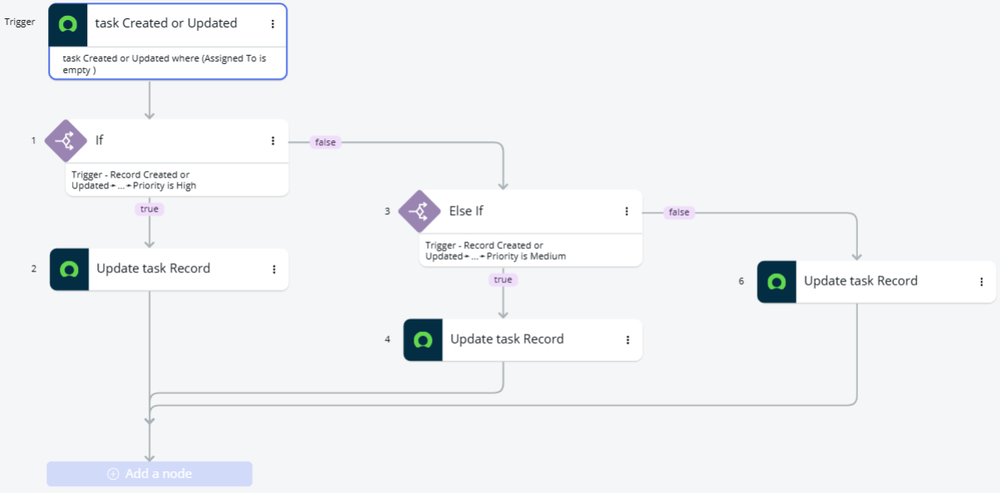

# Task Manager Application (ServiceNow)

## Overview

Custom task management application built using ServiceNow App Engine.

This project demonstrates practical use of workflow automation, business logic implementation, and data visualization within the ServiceNow platform.

---

## Features

- Automatic due date assignment based on task priority
- Email notification for high-priority tasks
- Automatic task assignment when no user is assigned
- Dashboard displaying task distribution by priority
- Workflow automation using Flow Designer

---

## How it works

1. User creates or updates a task
2. System evaluates task data (priority, assigned user, due date)
3. Based on conditions:
   - Due date is automatically assigned
   - Task may be auto-assigned
   - Email notification may be triggered
4. Dashboard updates dynamically based on task data

---

## Flows

### 1. Due Date & Notification Flow

This flow handles task prioritization and notifications.

**Trigger:**
- Task is created or updated
- Due date is empty
- Priority is defined

**Logic:**
- If Priority = High:
  - Send email notification
  - Assign due date
- If Priority = Medium:
  - Assign due date
- Else:
  - Assign default due date

**Purpose:**
Ensures important tasks are handled quickly and stakeholders are notified.

---

### 2. Auto Assignment Flow

This flow ensures tasks are not left unassigned.

**Trigger:**
- Task is created or updated
- Assigned To field is empty

**Logic:**
- Automatically assigns the task to a default user

**Purpose:**
Prevents tasks from being forgotten or ignored.

---

## Task Form

The task form is used for creating and managing tasks.

**Key fields:**
- Title
- Status
- Priority
- Assigned To
- Due Date
- Description

**Functionality:**
- Users input task data
- Fields are used by flows to trigger automation
- Updates to the form automatically trigger workflows

---

## Dashboard

The dashboard provides a visual overview of task data.

**Visualization:**
- Tasks grouped by Priority (High, Medium, Low)
- Displayed as a bar chart

**Purpose:**
- Quickly understand task distribution
- Identify high-priority workload
- Support decision-making

---

## Technologies

- ServiceNow App Engine Studio
- Flow Designer
- Platform Analytics

---

## Key Concepts Demonstrated

- Conditional logic (IF / ELSE) in Flow Designer
- Event-driven workflows
- Automated task management
- Data visualization using dashboards

---

## Screenshots

### Flow Logic

#### Due Date & Notification Flow

#### Auto Assignment Flow

---

### Dashboard

---

### Task Form

---

## Purpose

This project demonstrates practical use of ServiceNow for:

- process automation
- workflow configuration
- data visualization
