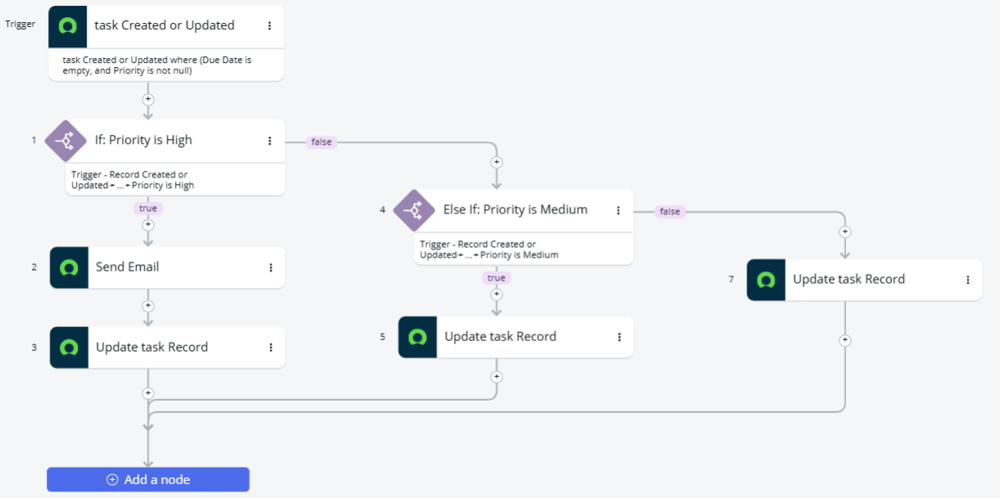
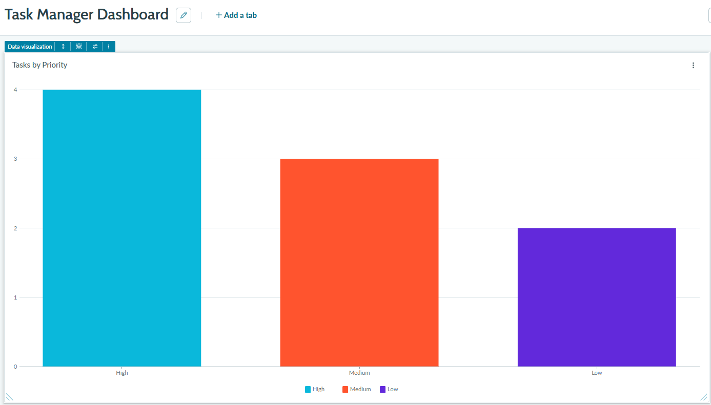
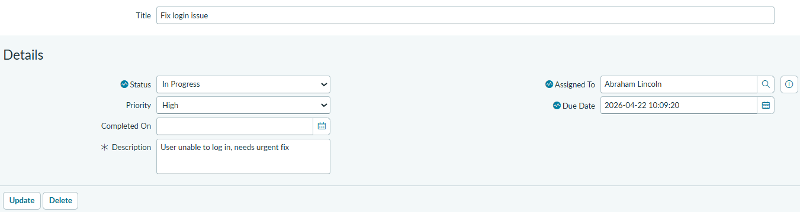

# Task Manager Application (ServiceNow)

## Overview

Custom task management application built using ServiceNow App Engine.
The project focuses on workflow automation, business logic, and basic analytics.

## Features

* Automatic due date assignment based on task priority
* Email notification for high-priority tasks
* Dashboard showing task distribution by priority
* Workflow automation using Flow Designer

## How it works

1. User creates a task
2. System evaluates task priority
3. Due date is assigned automatically
4. High priority tasks trigger email notification
5. Dashboard updates based on task data

## Technologies

* ServiceNow App Engine Studio
* Flow Designer
* Platform Analytics

## Screenshots

### Flow Logic

#### Due Date Assignment/Email Notification

#### Auto Assignment Flow

### Dashboard

### Task Form

### TaskForm:

## Purpose

This project demonstrates basic use of ServiceNow for:

* process automation
* workflow configuration
* data visualization
